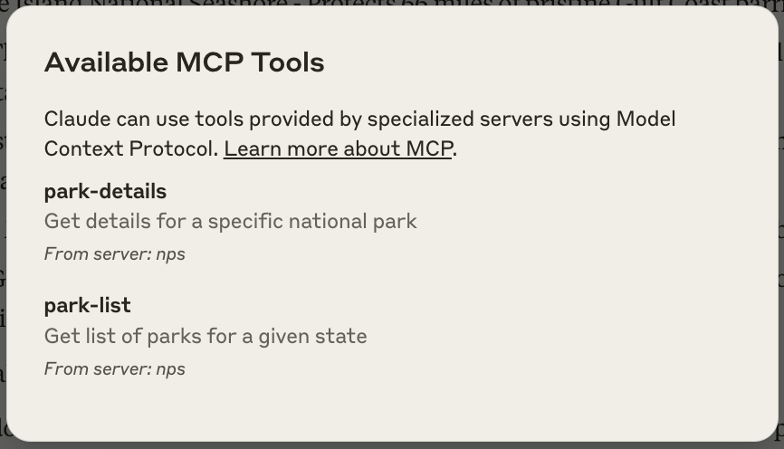
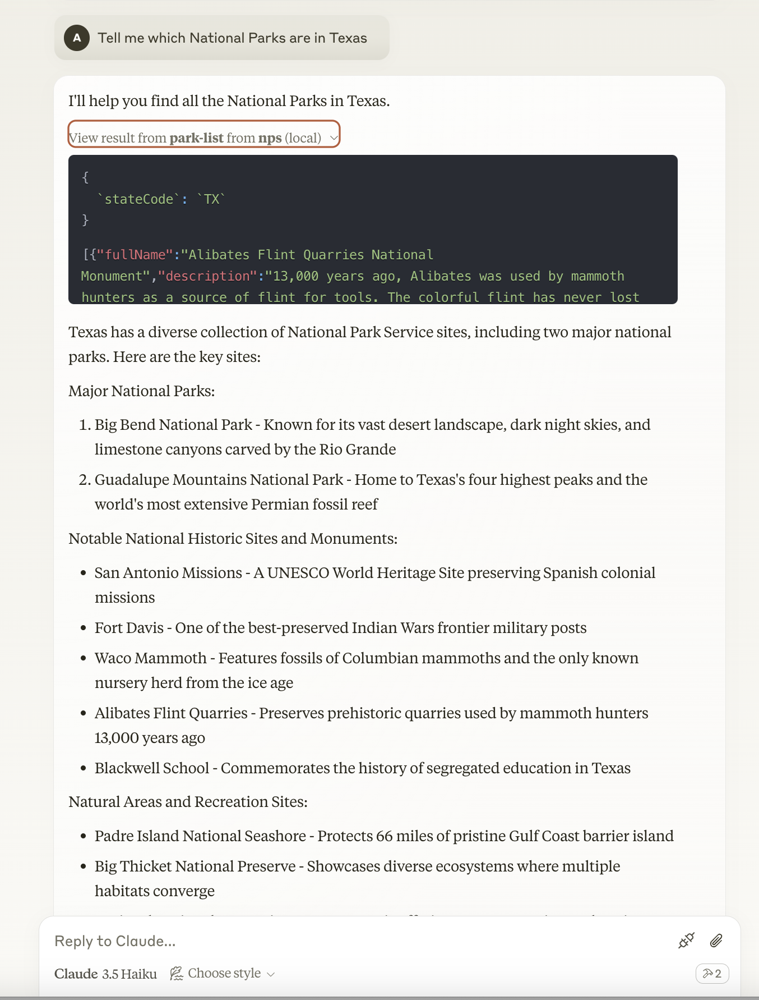
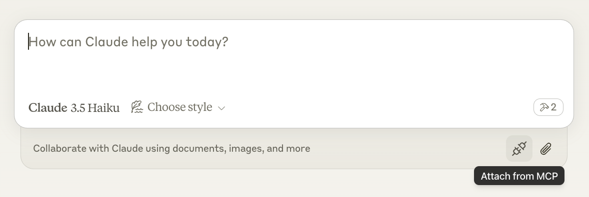
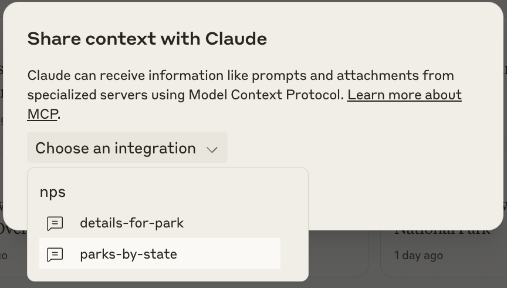
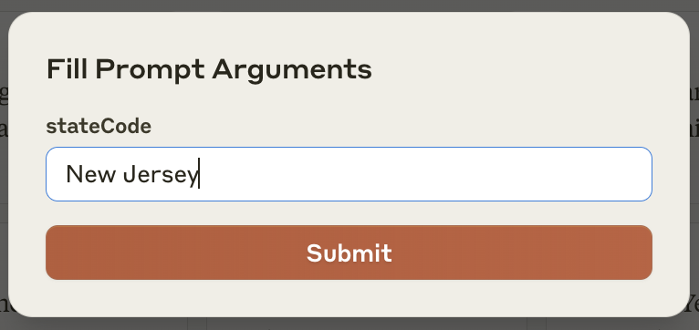
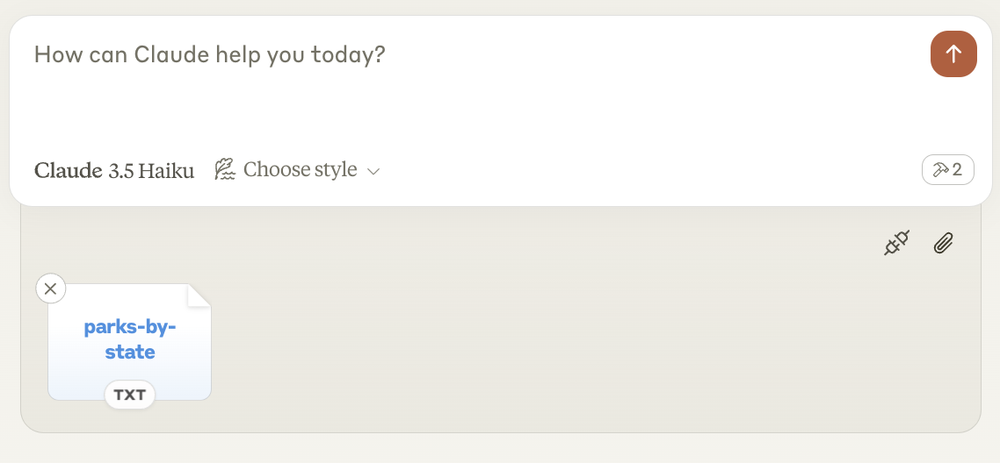
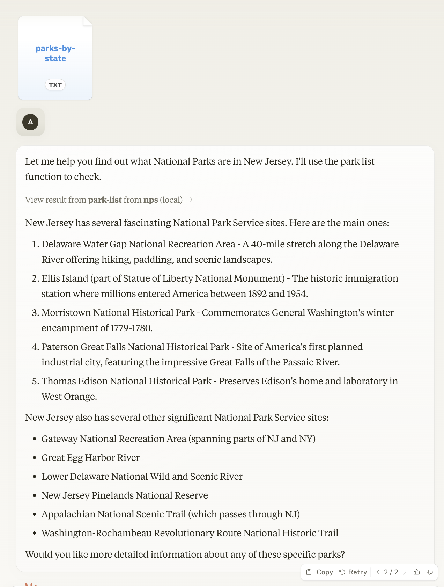

## My First MCP Server - Part 2

In my first post, [**Part 1**](./my-first-mcp-server.md), I built a Node.js STDIO MCP Server with a single tool to provide National Park Services information to the host LLM. I attempted to use this tool for various related questions but found that the tool was, at times, returning too much data for Claude Desktop to handle.

In this post, I will show the updates made to my MCP Server to fix the issue I was having with my first tool, as well as, add some prompts.

Again, I am relying heavily on the documentation for [**Model Context Protocol (MCP)**](https://modelcontextprotocol.io/introduction) and [**modelcontextprotocol/typescript-sdk**](https://github.com/modelcontextprotocol/typescript-sdk) to get this done.


### Updated Tools

My first attempt at using a tool to retrieve National Park Services data was working well when prompted for details regarding a single National Park. But, when asking for all the parks in a given state, Claude struggled with the amount of data returned. To fix this, I split my original tool into two: one to retrieve a list of parks given a state and one to retrieve details for a single park given a park code. I also created a separate functions to fetch and transform the data for each tool.

``` typescript
/**********************************************************************************************************************
 *  This function will fetch details for a national park given a park code
 *********************************************************************************************************************/
export const fetchParkDetails = async (parkCode: String) => {
  let start = 0;
  const limit = 50;
  let data = []
  let paginating = true;
  let params: ParamsType = { start, limit, parkCode };

  while (paginating) {
    const body = await fetchData('parks', params);
    data.push(...body.data);
    start += limit;
    if (body.total < start) {
      paginating = false;
    }
  }
  return data;
}

/**********************************************************************************************************************
 *  This function will return a list of parks for a given state
 *********************************************************************************************************************/
export const fetchParksList = async (stateCode: String) => {
  let start = 0;
  const limit = 50;
  let data = []
  let paginating = true;
  let params: ParamsType = { start, limit, stateCode };

  while (paginating) {
    const body = await fetchData('parks', params);
    data.push(...body.data);
    start += limit;
    if (body.total < start) {
      paginating = false;
    }
  }
  return data.map(item => ({ fullName: item.fullName, description: item.description, parkCode: item.parkCode }));
}

/**********************************************************************************************************************
 *  MCP Server for National Park Services data
 *  - retrieve list of parks given a state
 *  - get details about a park given a park code
 *********************************************************************************************************************/
const server = new McpServer(
  {
    name: "nps",
    version: "1.0.0",
  }
);

// tool for fetching park details
server.tool(
  "park-details",
  "Get details for a specific national park",
  {
    parkCode: z.string().describe("National Park lookup code"),
  },
  async ({ parkCode }) => {
    const data = await fetchParkDetails(parkCode);
    return { content: [{ type: "text", text: JSON.stringify(data) }] }
  }
);

server.tool(
  "park-list",
  "Get list of parks for a given state",
  {
    stateCode: z.string().describe("Two-letter state code")
  },
  async ({ stateCode }) => {
    const data = await fetchParksList(stateCode);
    return { content: [{ type: "text", text: JSON.stringify(data) }] }
  }
);
```

I rebuilt my MCP Server with `npm run build` and restarted Claude Desktop. Now, I can see my two tools available.



And when I query Claude for parks in a given state, I now get results:




### MCP Prompts

Along with tools, you can add prompt templates to your MCP Server. I experimented with some simple prompts, next.

These prompts have a single argument: a state code for the `parks-by-state` prompt and a park code for the `details-for-park` prompt. Each prompt message is crafted using the argument variable and string interpolation.

```
server.prompt(
  "parks-by-state",
  { stateCode: z.string() },
  ({ stateCode }) => ({
    messages: [{
      role: "user",
      content: {
        type: "text",
        text: `What National Parks are in the state of ${stateCode}`
      }
    }]
  })
);

server.prompt(
  "details-for-park",
  { park: z.string() },
  ({ park }) => ({
    messages: [{
      role: "user",
      content: {
        type: "text",
        text: `Give me details about ${park}`
      }
    }]
  })
);
```

After adding these prompts, I rebuilt my server and restarted Claude. Now, when I click on the "Attach from MCP" icon in the chat window (shown below), I can see my new prompts in context integrations.





When choosing one of these integrations, Claude will prompt me for the necessary arguments to include. After providing a value and clicking the `Submit` button, the prompt is ready to be submitted as shown below. All that is necessary now, is to click on the up arrow in the chat window submitting the query to Claude Desktop.





And below was my successful result using my prompt template:



### Conclusion

While I did run into some errors using Claude Desktop after these changes, they seem to be intermittent and related to overal Claude availability. For testing purposes, Claude Desktop and The MCP Inspector mentioned in Part 1 are quick tools, very helpful but limited.

My next endeavor will be to build an HTTP SSE Server and a custom MCP Client. Stay tuned.