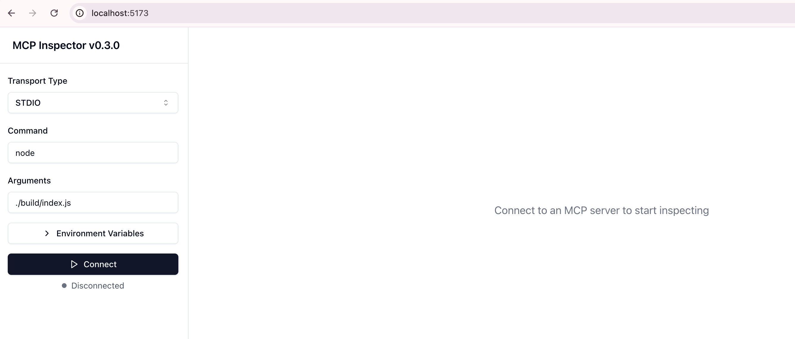
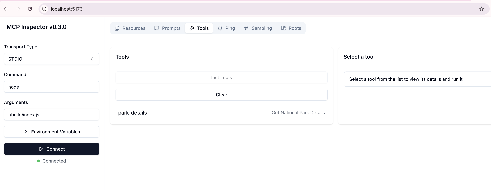
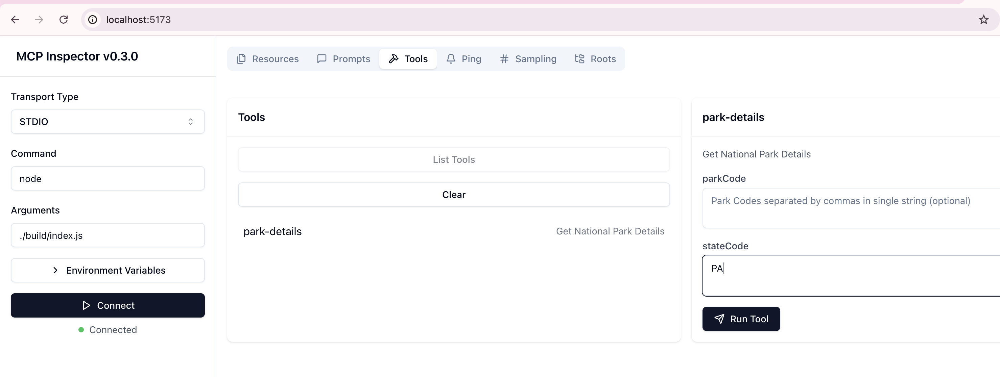
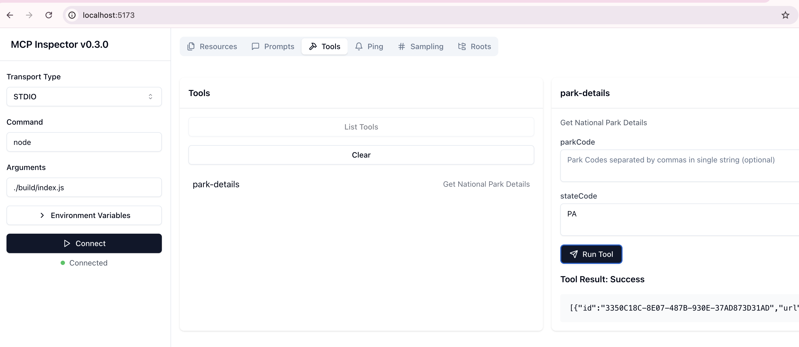

## My First MCP Server  

I decided to build a Node.js server because I’m comfortable with JavaScript and MCP provides resources for JS developers. To do this, I relied a lot on the documentation from both the [**Model Context Protocol (MCP)**](https://modelcontextprotocol.io/introduction) site and the [**modelcontextprotocol/typescript-sdk**](https://github.com/modelcontextprotocol/typescript-sdk) library.  

The MCP server I built connects to a government API that provides National Park Service (NPS) data. If you’re interested, you can check out the API and sign up for a key [here](https://www.nps.gov/subjects/developer/get-started.htm).  

I started by experimenting with the NPS API and writing some functions I planned to use in the server. The **/parks** endpoint turned out to be really useful—it provides a ton of information and lets you search by state or park code. I also found another endpoint that lists all the park codes, which I figured I’d need to translate full park names into codes before pulling details. Turns out, **Claude Desktop** is able to handle that for me. Still, I left the code in place—just in case I need it later.  


```typescript
import dotenv from "dotenv";

// environment variables
dotenv.config();

const BASE_URL = "https://developer.nps.gov/api/v1";
const API_KEY = process.env.API_KEY || "Key Not Supplied";

const headers = {
  'Content-Type': 'application/json',
  'X-Api-Key': API_KEY
}

interface ParamsType {
  start: Number
  limit: Number
  parkCode?: String
  stateCode?: String
}

/**********************************************************************************************************************
 *  This function will perform the fetch given an endpoint and params; the NPS endpoints are all GET methods
 *********************************************************************************************************************/
export const fetchData = async (endpoint: string, params: any | {}) => {
  const url = new URL(`${BASE_URL}/${endpoint}`);
  url.search = new URLSearchParams(params).toString();

  const options = {
    method: 'GET',
    headers
  };

  try {
    const response = await fetch(url, options);
    if (!response.ok) {
      throw new Error(`HTTP error! Status: ${response.status}`);
    }
    const data = await response.json();
    return data;
  } catch (error) {
    console.error("Error fetching data:", error);
  }
}

/**********************************************************************************************************************
 *  This function will fetch all of the national parks and return the code, states array, and full name
 *  These codes can then be used to fetch detailed information for specific parks and/or states
 *********************************************************************************************************************/
export const fetchAllParkCodes = async () => {
  let codes = [];
  let start = 0;
  const limit = 50;
  let data;
  let paginating = true;

  while (paginating) {
    const body = await fetchData('parks', { start, limit });
    data = body.data;
    // @ts-ignore
    codes.push(...data.map(item => (
      { parkCode: item.parkCode, fullName: item.fullName, states: item.states.split(',') }
    )));
    start += limit;
    if (body.total < start) {
      paginating = false;
    }
  }
  return codes;
}

/**********************************************************************************************************************
 *  This function will fetch details for a national park or several national parks depending on query
 *  Can search by park codes, states, or return all parks
 *********************************************************************************************************************/
export const fetchParkDetails = async (parkCode: String[] = [], stateCode: String[] = []) => {
  let start = 0;
  const limit = 50;
  let data = [];
  let paginating = true;
  let params: ParamsType = { start, limit };

  if (parkCode.length) {
    params = { ...params, parkCode: parkCode.join(",") };
  }
  if (stateCode.length) {
    params = { ...params, stateCode: stateCode.join(",") };
  }

  while (paginating) {
    const body = await fetchData('parks', params);
    data.push(...body.data);
    start += limit;
    if (body.total < start) {
      paginating = false;
    }
  }
  return data;
}
```

Once I had an idea of which API I was going to use and the structure of its request and response, I moved forward with building the MCP Server.

### Setup

I installed the dependencies:

```
npm install @modelcontextprotocol/sdk zod
npm install -D @types/node typescript
```

Updated my package.json to include the necessary build script and set the type to module.

```
{
  "name": "nps",
  "type": "module",
  "version": "1.0.0",
  "description": "MCP using National Park Service API",
  "main": "index.js",
  "bin": {
    "nps": "./build/index.js"
  },
  "scripts": {
    "build": "tsc && node -e \"require('fs').chmodSync('build/index.js', '755')\""
  },
  "files": [
    "build"
  ],
  "author": "A. Satterlee",
  "license": "ISC",
  "dependencies": {
    "@modelcontextprotocol/sdk": "^1.4.1",
    "dotenv": "^16.4.7"
  },
  "devDependencies": {
    "@types/node": "^22.12.0",
    "typescript": "^5.7.3"
  }
}
```

And I added the tsconfig.json file.

```
{
  "compilerOptions": {
    "target": "ES2022",
    "module": "Node16",
    "moduleResolution": "Node16",
    "outDir": "./build",
    "rootDir": "./src",
    "strict": true,
    "esModuleInterop": true,
    "skipLibCheck": true,
    "forceConsistentCasingInFileNames": true
  },
  "include": ["src/**/*"],
  "exclude": ["node_modules"]
}
```

### MCP Server Code

I grabbed the starter code included in the library’s [documentation](https://github.com/modelcontextprotocol/typescript-sdk?tab=readme-ov-file#stdio) and added my single tool for fetching park details from the NPS API.

```
import { McpServer } from "@modelcontextprotocol/sdk/server/mcp.js";
import { StdioServerTransport } from "@modelcontextprotocol/sdk/server/stdio.js";
import { z } from "zod";
```
```
/**********************************************************************************************************************
 *  MCP Server for National Park Services data
 *  Can search by park codes, states, or return all parks
 *********************************************************************************************************************/
const server = new McpServer(
  {
    name: "nps",
    version: "1.0.0",
  }
);

// tool for fetching park details
server.tool(
  "park-details",
  "Get National Park Details",
  {
    parkCode: z.string().optional().describe("Park Codes separated by commas in single string (optional)"),
    stateCode: z.string().optional().describe("Two-letter state codes separated by commas in single string (optional)")
  },
  async ({ parkCode, stateCode }) => {
    const data = await fetchParkDetails(parkCode?.split(","), stateCode?.split(","));
    return { content: [{ type: "text", text: JSON.stringify(data) }] }
  }
);

// connect and start receiving messages
const transport = new StdioServerTransport();
await server.connect(transport);
```

Since I am building a server to run on my local machine, I used the STDIO server approach. I had also experimented with creating an HTTP SSE server but found I was getting ahead of myself and took a step back to learn the basics.

### Initial Testing

In order to test a node MCP Server I needed a client that understands and follows the protocol, an MCP client. A quick way to test my server is by using the MCP Inspector client.

In the root directory, I ran `npm run build` and then `npx @modelcontextprotocol/inspector node ./build/index.js` which started the MCP Inspector.



In my case, the defaults were appropriate. This is an STDIO server that is initiated with `node ./build/index.js` command.

To test my single tool, I navigated to the Tools tab at the top and clicked the List Tools button. My tool `park-detail` was returned and I could then click on that to use it.



The panel on the right has the description and arguments for my park-details tool. Both are optional arguments and if none are provided, the entire list should be returned.



I received successful results when clicking on “Run Tool” indicating my server was functioning as expected.



### Claude Desktop with Local MCP Server
